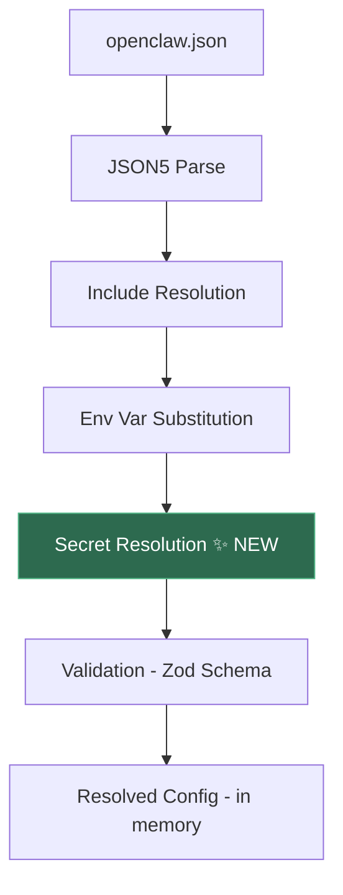
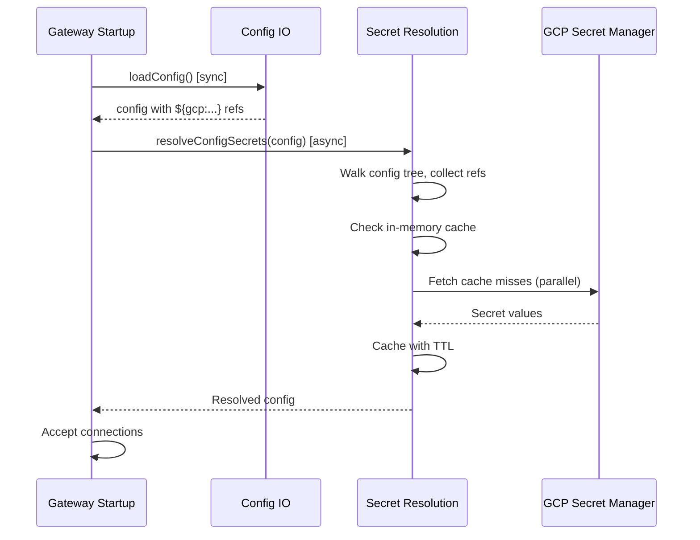

# Design: External Secrets Management for OpenClaw

**Requirements:** [REQUIREMENTS-gcp-secrets.md](./REQUIREMENTS-gcp-secrets.md)
**Author:** Rye (AI) + Amichay Oren
**Date:** 2026-02-15
**Status:** Draft

---

## 1. Overview

This document describes HOW the external secrets management feature will be implemented in OpenClaw, satisfying the requirements defined in the companion requirements document.

## 2. Architecture

The system introduces three new components into the OpenClaw config pipeline:



The three new components:
1. **Secret Resolution Module** — resolves `${gcp:name}` references in config at load time
2. **GCP Provider** — communicates with GCP Secret Manager API
3. **CLI Commands** — `openclaw secrets` subcommands for setup, migration, and management

## 3. Config Schema

### 3.1 Secrets Configuration

A new top-level `secrets` section in `openclaw.json`:

```json5
{
  secrets: {
    // Default provider used when reference doesn't specify one
    defaultProvider: "gcp",
    
    providers: {
      gcp: {
        // GCP project ID (required)
        project: "my-gcp-project",
        
        // Cache TTL in seconds (default: 300)
        cacheTtlSeconds: 300,
        
        // Optional: path to service account key file
        // If omitted, uses Application Default Credentials (ADC)
        credentialsFile: "/path/to/service-account.json"
      }
    }
  }
}
```

### 3.2 Secret Reference Syntax

References follow the pattern: `${provider:secret-name}`

```json5
{
  tools: {
    web: {
      search: {
        apiKey: "${gcp:openclaw-brave-api-key}"
      }
    }
  }
}
```

- Provider prefix is required (no implicit provider) to keep references unambiguous
- Secret name allows: `[a-zA-Z0-9_\-/.]`
- Version pinning via `#version` suffix: `${gcp:my-secret#3}` (default: `latest`)
- Escaped with `$${}` (consistent with env var escaping)

### 3.3 Distinction from Env Var References

| Syntax | Resolved by | Example |
|---|---|---|
| `${UPPER_CASE}` | env-substitution.ts (existing) | `${BRAVE_API_KEY}` |
| `${lowercase:name}` | secret-resolution.ts (new) | `${gcp:brave-api-key}` |

The lowercase provider prefix naturally distinguishes secret refs from env var refs (which require uppercase names). No ambiguity.

## 4. Secret Resolution Module

### 4.1 Location

`src/config/secret-resolution.ts` — parallel to existing `env-substitution.ts`

### 4.2 Interface

```typescript
// Provider interface — extensible for future AWS/Vault/Azure providers
interface SecretProvider {
  name: string;
  
  // Fetch a secret value. Throws on failure.
  getSecret(name: string, version?: string): Promise<string>;
  
  // Store a secret (used by migration tool)
  setSecret(name: string, value: string): Promise<void>;
  
  // List all secrets (used by CLI)
  listSecrets(): Promise<string[]>;
  
  // Test connectivity
  testConnection(): Promise<{ ok: boolean; error?: string }>;
}
```

### 4.3 Resolution Flow

1. After env var substitution, walk the config tree recursively
2. For each string value, check for `${provider:name}` patterns
3. Collect all references, deduplicate
4. Check in-memory cache — return cached values if TTL not expired
5. For cache misses, fetch from provider in parallel (batch network calls)
6. Store in cache with TTL
7. Replace references with resolved values
8. Return resolved config

### 4.4 Caching

- **Storage**: In-memory `Map<string, { value: string, expiresAt: number }>`
- **TTL**: Configurable per-provider, default 300 seconds
- **Invalidation**: Cache cleared on SIGUSR1 restart or `clearSecretCache()` call
- **Stale-while-revalidate**: If provider is unreachable and cache has expired entries, use stale values and log a warning
- **Never persisted to disk**

### 4.5 Async Handling

Config loading in OpenClaw is currently synchronous (`loadConfig()` returns `OpenClawConfig`). Secret resolution requires async network calls. Two approaches:

`loadConfig()` remains synchronous and returns config with unresolved `${gcp:...}` strings. A separate async function `resolveConfigSecrets(config)` is called after load. Gateway startup awaits secret resolution before accepting connections.

This is the least invasive approach — secret resolution is an optional post-processing step that only runs if a `secrets` config section exists. No changes to existing synchronous call sites.



## 5. GCP Provider Implementation

### 5.1 Dependencies

- `@google-cloud/secret-manager` — Google's official client library
- Added as an **optional peer dependency** (not required for installations that don't use GCP)
- Dynamically imported at runtime: `const { SecretManagerServiceClient } = await import("@google-cloud/secret-manager")`

### 5.2 Authentication (runtime)

Agents authenticate to GCP Secret Manager using Application Default Credentials (ADC), resolved in this order:
1. `credentialsFile` in config (explicit service account key)
2. `GOOGLE_APPLICATION_CREDENTIALS` environment variable
3. Compute Engine / GKE metadata server
4. User credentials from `gcloud auth application-default login`

No `gcloud` CLI needed at runtime.

### 5.3 Secret Path Construction

User provides short name → provider constructs full resource path:

```
Input:  "openclaw-brave-api-key"
Output: "projects/my-gcp-project/secrets/openclaw-brave-api-key/versions/latest"

Input:  "openclaw-brave-api-key#3"
Output: "projects/my-gcp-project/secrets/openclaw-brave-api-key/versions/3"
```

### 5.4 Per-Agent Isolation

For multi-agent setups, secrets are namespaced by convention:

```
openclaw-main-anthropic-token
openclaw-chai-openai-token
openclaw-shared-brave-api-key
```

IAM bindings control access:
- Main agent's service account → access to `openclaw-main-*` and `openclaw-shared-*`
- Chai's service account → access to `openclaw-chai-*` and `openclaw-shared-*`

The bootstrap tool creates per-agent service accounts and configures these bindings.

## 6. Auth Profiles Integration

`auth-profiles.json` also supports secret references:

```json
{
  "profiles": {
    "openai:default": {
      "type": "token",
      "provider": "openai",
      "token": "${gcp:openclaw-chai-openai-token}"
    }
  }
}
```

Auth profile resolution reuses the same `SecretProvider` and cache as config resolution.

## 7. CLI Commands

### 7.1 `openclaw secrets setup`

Bootstrapping command. Performs:

1. Check if `gcloud` CLI is available and authenticated
2. Check if Secret Manager API is enabled → enable if not
3. Create per-agent service accounts (if multi-agent):
   - `openclaw-main@{project}.iam.gserviceaccount.com`
   - `openclaw-chai@{project}.iam.gserviceaccount.com`
4. Create service account keys and store them locally
5. Configure IAM bindings (secretAccessor role per agent)
6. Update `openclaw.json` with `secrets.providers.gcp` config
7. Print summary of changes

Interactive: every destructive/billable action requires confirmation unless `--yes` is passed.

### 7.2 `openclaw secrets migrate`

Migration command. Performs:

1. Scan `openclaw.json` for sensitive values (uses existing `schema.hints.ts` sensitivity annotations)
2. Scan `auth-profiles.json` for tokens/keys
3. Scan known credential file paths (`~/.config/*/`)
4. For each found secret:
   a. Generate a name: `openclaw-{agent}-{provider}-{purpose}` (e.g., `openclaw-main-anthropic-token`)
   b. Upload to GCP Secret Manager
   c. Replace value in config with `${gcp:name}`
5. Verify all references resolve correctly
6. Prompt to purge plaintext files
7. Print migration report

### 7.3 `openclaw secrets test`

Validates the current setup:
- Provider configured and reachable
- All `${gcp:...}` references in config resolve successfully
- IAM permissions are correct
- Reports any issues with actionable remediation steps

### 7.4 `openclaw secrets list`

Lists configured providers and their status (connected, unreachable, not configured).

### 7.5 `openclaw secrets set --provider gcp --name <name> --value <value>`

Convenience command to store a secret manually.

## 8. Redaction

### 8.1 Config API Responses

The existing `redact-snapshot.ts` already handles `__OPENCLAW_REDACTED__` sentinels. Secret references (`${gcp:...}`) are preserved as-is in API responses — they are already safe to display since they contain no secret values, just references.

### 8.2 Logging

The subsystem logger for secret resolution must:
- Log which secrets are being fetched (by name)
- Never log secret values
- Log cache hits/misses at debug level
- Log errors with actionable messages

## 9. Error Handling

| Error | Behavior |
|---|---|
| Provider not configured | `UnknownSecretProviderError` at resolution time. Feature using the secret fails; system continues. |
| Secret not found | `SecretResolutionError` with message: "Secret '{name}' not found in project '{project}'" |
| Permission denied | `SecretResolutionError` with message: "Permission denied for secret '{name}'. Check IAM bindings." |
| Network timeout | Retry once after 2s. If still failing, use stale cache if available, else `SecretResolutionError`. |
| `@google-cloud/secret-manager` not installed | Clear error at first reference resolution: "Install @google-cloud/secret-manager to use GCP secrets" |
| Invalid reference syntax | Error at config parse time |

## 10. File Changes Summary

### New Files
- `src/config/secret-resolution.ts` — Core resolution module + GCP provider
- `src/config/secret-resolution.test.ts` — Unit tests
- `src/commands/secrets.ts` — CLI commands (setup, migrate, test, list, set)
- `src/commands/secrets.test.ts` — CLI command tests
- `docs/concepts/secrets.md` — User documentation

### Modified Files
- `src/config/config.ts` — Export new module
- `src/config/io.ts` — Call `resolveConfigSecrets()` after env substitution in config load pipeline
- `src/config/schema.ts` / `src/config/zod-schema.ts` — Add `secrets` section to schema
- `src/config/types.ts` — Add `SecretsConfig` type
- `src/config/redact-snapshot.ts` — Ensure secret refs are preserved (not double-redacted)
- `src/gateway/` — Await secret resolution during startup
- `src/cli/` — Register `secrets` subcommand
- `package.json` — Add `@google-cloud/secret-manager` as optional peer dependency

## 11. Testing Strategy

### Unit Tests (secret-resolution.test.ts)
- Reference pattern parsing (valid/invalid syntax)
- Cache behavior (TTL, stale-while-revalidate, clear)
- Error handling (missing provider, missing secret, network failure)
- Config tree walking (nested objects, arrays, mixed refs)
- GCP provider with mocked client (fetch, store, list)
- No-op when `secrets` section not configured

### Integration Tests
- Bootstrap setup on real GCP project (CI with test project)
- End-to-end: store secret → reference in config → resolve → verify
- Migration: create plaintext config → migrate → verify refs work → verify purge

### CLI Tests (secrets.test.ts)
- Each subcommand with mocked provider
- Interactive prompts (confirm before purge)
- Error cases (no gcloud, wrong permissions)

## 12. Rollout & Backward Compatibility

- Feature is entirely opt-in: no `secrets` config = no behavior change
- `@google-cloud/secret-manager` is optional: not installed = clear error only if `${gcp:...}` is used
- Existing env var substitution (`${UPPER_CASE}`) is unaffected
- Config files without secret refs pass through the resolution step unchanged (fast path: skip if no `secrets` config)

---

*This document describes HOW the requirements will be implemented. Code will be written after this design is approved, starting with tests (TDD).*
